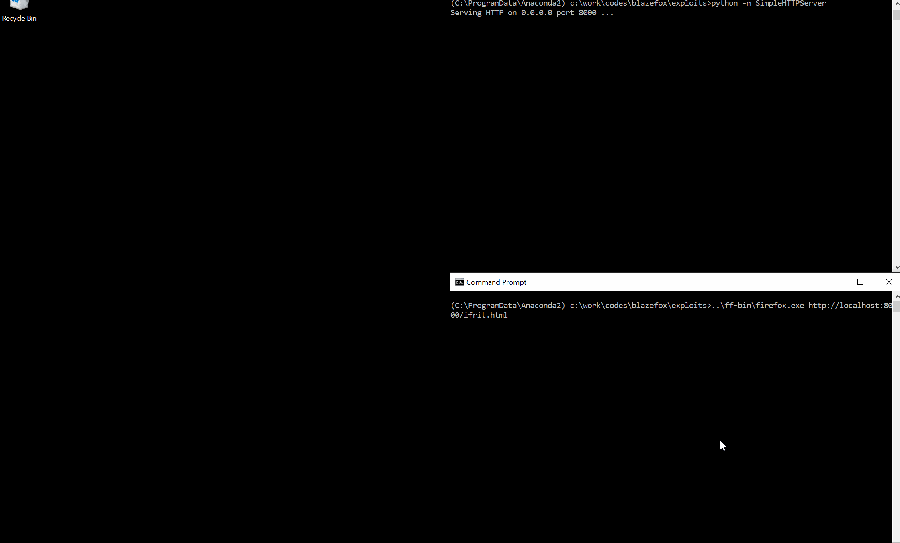

# Blazefox exploits for Windows 10 RS5 64-bit

This the repository associated with the article [Introduction to SpiderMonkey exploitation](https://doar-e.github.io/blog/2018/11/19/introduction-to-spidermonkey-exploitation/).

## Overview

`Blazefox` is an exploitation challenge written by [itszn](https://twitter.com/itszn13) for [Blaze CTF 2018](https://ctftime.org/event/591). The author added a `blaze` method to JavaScript Arrays that sets the size of the backing buffer to 420. This gives the attacker an out-of-bounds memory primitive.

## Organization

* Three exploits are documented and available in [exploits](https://github.com/0vercl0k/blazefox/tree/master/exploits),
* A *WindDbg* JavaScript extension that allows to dump `js::Value` and `JSObject` objects in [sm](https://github.com/0vercl0k/blazefox/tree/master/sm),
* Various scripts built during the research in [scripts](https://github.com/0vercl0k/blazefox/tree/master/scripts),
* An x64 debug build of the JavaScript shell (along private symbol information) in [js-asserts](https://github.com/0vercl0k/blazefox/releases/download/1/js-asserts.7z), and an x64 release build in [js-release](https://github.com/0vercl0k/blazefox/releases/download/1/js-release.7z),
* The sources matching [js-release](https://github.com/0vercl0k/blazefox/releases/download/1/js-release.7z) private symbol information in [src/js](https://github.com/0vercl0k/blazefox/tree/master/src/js),
* Last but not least, 7z archives of the Firefox binaries (along with `xul.dll` private symbol information) I compiled for Windows 64-bit in [ff-bin.7z](https://github.com/0vercl0k/blazefox/releases/download/1/ff-bin.7z).

