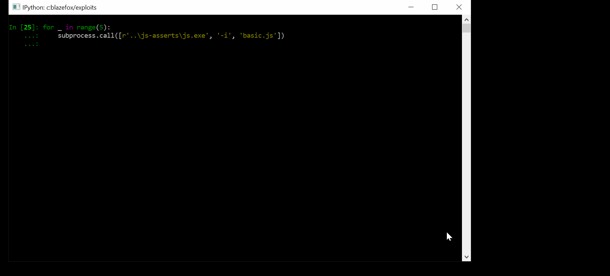
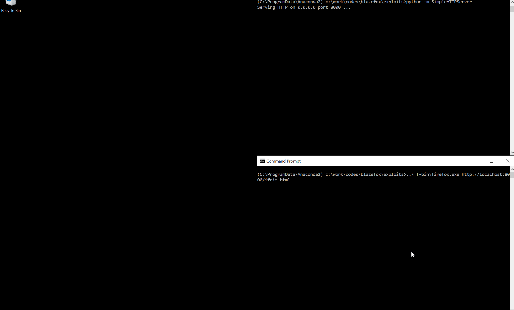

# Exploits

There are three blazefox exploits in this repository written against [Spidermonkey](https://github.com/mozilla/gecko-dev/tree/master/js) and [Firefox](https://www.mozilla.org/en-US/firefox/new/) on Windows 10 RS5 x64, ranging from very simple and dumb to a bit less simple and dumb :).

For more details see the associated blogpost here: [TODO]().

## basic.js

`basic.js` is the most basic version of the exploit but also the most reliable. It is meant to work against a very specific version of [Spidermonkey](https://github.com/mozilla/gecko-dev/tree/master/js)'s [JavaScript shell](https://github.com/mozilla/gecko-dev/tree/master/js/src/shell) and a very specific version of `ntdll.dll` (which is available in the [js-asserts](https://github.com/0vercl0k/blazefox/tree/master/js-asserts) for a couple of ROP gadgets (I have actually updated my machine to RS5 recently and it naturally broke this exploit so I had to fix it :)).

## kaizen.js

`kaizen.js` is the direct evolution of `basic.js` as in it is designed to work more reliably (and not tied to specific version of binaries). If it needs offsets to work, it'll go and find it itself, like a big boy.

## ifrit.js

`ifrit.js` is the final exploit that targets the Firefox browser. It leverages IonMonkey to have it JIT our entire native payload for us - **B**ring **Y**our **O**wn **P**ayload ([byop.js](https://github.com/0vercl0k/blazefox/blob/master/exploits/byop.js)) people.

